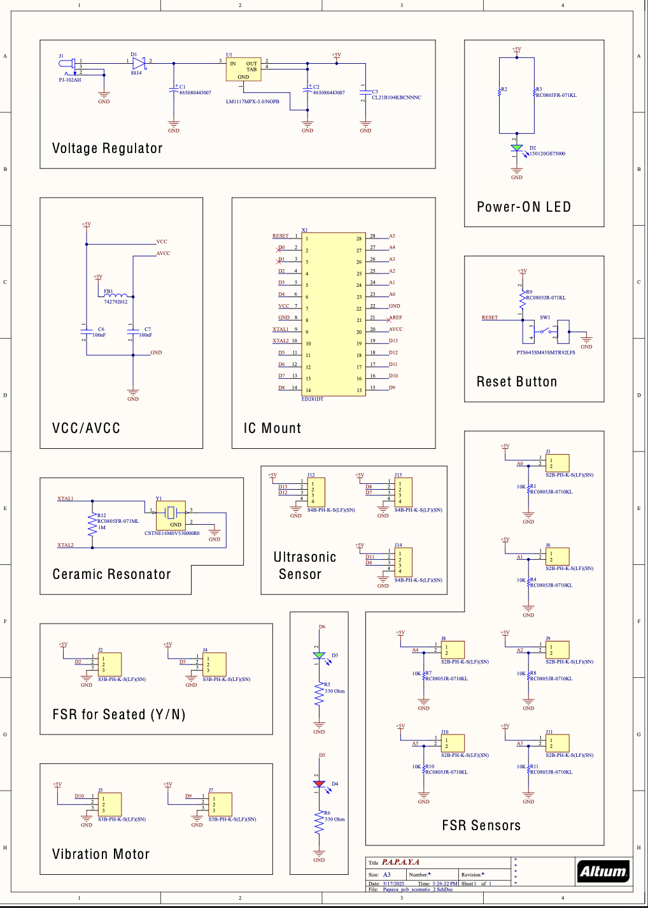
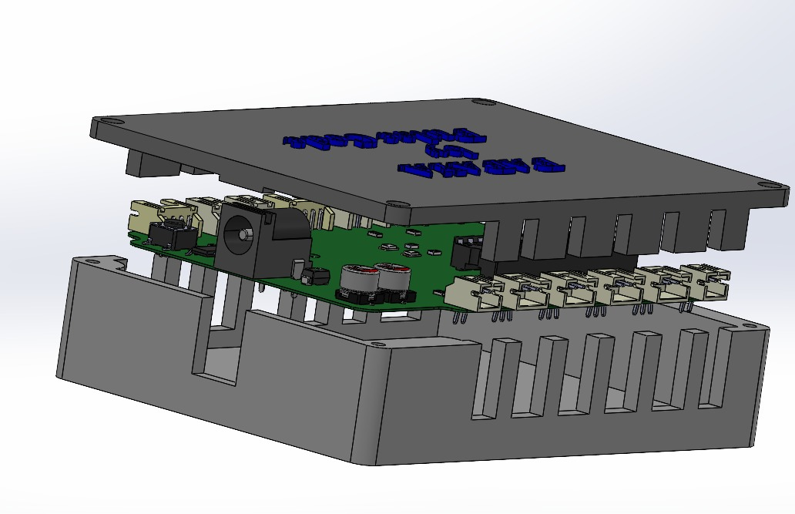

## P.A.P.A.Y.A._by_PulseCode

> **Posture Analysis and Proactive Alignment for Your Awareness**  
> A smart cushion that detects poor sitting posture in real-time and provides subtle haptic feedback to encourage healthy sitting habits.

🏆 **2nd Runners Up – Brainstorm 2025**  
📍 **University of Moratuwa – BM1190 Engineering Design Project**

---

## 📜 Project Overview
PulseCode is a human-centered ergonomic solution to combat posture-related back pain among desk-bound individuals.  
It combines **pressure sensors**, **distance sensing**, and **vibration feedback** to help users build healthy sitting habits without intrusive devices.

---

## 🛠 Features
- **8x FSR402 pressure sensors** for seat pressure mapping
- **Ultrasonic sensor (HC-SR04)** for back distance measurement
- **ATmega328P microcontroller** for posture logic
- **Vibration motor** for subtle posture alerts
- **Custom PCB** and **SolidWorks-designed enclosures**
- **LED battery level indicator**, USB-C charging, 7.4V Li-ion battery
- **Automotive-grade foam cushion**

---
**Final Product :**

  
  &nbsp;&nbsp;&nbsp;&nbsp; &nbsp;&nbsp; &nbsp;  &nbsp; &nbsp; &nbsp;&nbsp; &nbsp; &nbsp; &nbsp; &nbsp; &nbsp; &nbsp; 
  
  &nbsp;&nbsp;&nbsp;

---

**System Architecture & Schematic :**

&nbsp;&nbsp;&nbsp;&nbsp; &nbsp;&nbsp; &nbsp;  &nbsp;&nbsp; &nbsp; &nbsp; &nbsp;&nbsp; &nbsp; &nbsp; &nbsp;&nbsp; &nbsp;&nbsp;  &nbsp; &nbsp; &nbsp; &nbsp;&nbsp;  &nbsp;&nbsp;&nbsp; &nbsp;

---

**PCB Design :**

  
  &nbsp;&nbsp;&nbsp;
  
  &nbsp;&nbsp;&nbsp;
  

---

**Enclosure Design :**

  &nbsp;&nbsp;&nbsp;&nbsp;&nbsp;&nbsp;&nbsp;&nbsp;&nbsp;&nbsp;&nbsp;&nbsp;&nbsp;

 

